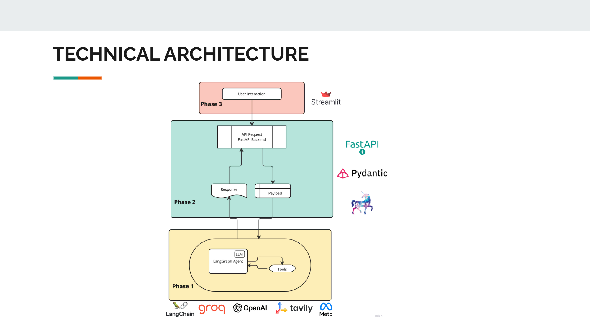

# End-to-End AI Agent Chatbot with FastAPI, LangGraph, and LangChain


## 🚀 Overview
This project implements a robust, end-to-end **AI-powered chatbot** leveraging **FastAPI, LangGraph, and LangChain**. The chatbot is designed for intelligent conversation handling, contextual memory, and real-time responses.

## 🛠️ Tech Stack
- **FastAPI**: High-performance API framework for serving the chatbot.
- **LangGraph**: Enables graph-based reasoning and conversational flow control.
- **LangChain**: Framework for chaining large language models (LLMs) with external tools and memory.
- **LLM (GPT, LLaMA, Mistral, etc.)**: Used for natural language understanding and response generation.
- **FAISS**: Vector database for efficient semantic search and memory retrieval.
- **Docker**: Containerization for deployment.
- **SQLite / PostgreSQL**: Database for storing chat history and metadata.
- **Redis**: Caching layer for optimizing chatbot response times.

## 🎯 Features
✅ **Conversational AI** - Engages in human-like conversations using LLMs.
✅ **Contextual Memory** - Remembers previous interactions for a seamless experience.
✅ **Graph-based Reasoning** - Uses LangGraph for structured response generation.
✅ **Tool Integration** - Fetches live data, executes calculations, and integrates external APIs.
✅ **FastAPI Backend** - High-performance and scalable chatbot backend.
✅ **WebSocket Support** - Enables real-time bidirectional communication.
✅ **Vector Database** - Uses FAISS for embedding-based search and retrieval.
✅ **Multi-Model Support** - Works with various LLMs (OpenAI, Hugging Face models, etc.).
✅ **Easy Deployment** - Dockerized setup for quick deployment on cloud services.

## 🏗️ Architecture
The chatbot follows a modular and scalable architecture:



- **Frontend**: Communicates via API/WebSockets.
- **FastAPI Backend**: Handles user requests and integrates with LangGraph.
- **LangChain & LangGraph**: Manages conversation flow and reasoning.
- **LLM Engine**: Generates responses using AI models.
- **Vector Store**: Stores embeddings for contextual memory.
- **Database**: Stores user interactions and chat history.
- **Cache Layer (Redis)**: Improves response speed and efficiency.

## 📌 Installation & Setup

### 1️⃣ Clone the Repository
```sh
git clone https://github.com/your-repo/ai-agent-chatbot.git
cd ai-agent-chatbot
```

### 2️⃣ Create a Virtual Environment & Install Dependencies
```sh
python -m venv venv
source venv/bin/activate  # On Windows use `venv\Scripts\activate`
pip install -r requirements.txt
```

### 3️⃣ Set Up Environment Variables
Create a `.env` file in the root directory:
```
OPENAI_API_KEY=your_openai_key
REDIS_URL=redis://localhost:6379
DB_URL=sqlite:///./database.db
```

### 4️⃣ Run the FastAPI Server
```sh
uvicorn app.main:app --reload --host 0.0.0.0 --port 8000
```

### 5️⃣ Access API Docs
FastAPI automatically generates Swagger UI for API documentation.
Visit: **[http://localhost:8000/docs](http://localhost:8000/docs)**

## 🎭 Example API Usage
### 🔹 Send a Chat Message
```sh
curl -X POST "http://localhost:8000/chat" -H "Content-Type: application/json" -d '{"message": "Hello AI!"}'
```

### 🔹 Streaming Chat via WebSockets
```python
import websockets
import asyncio

async def chat():
    uri = "ws://localhost:8000/chat"
    async with websockets.connect(uri) as websocket:
        await websocket.send("Hello AI!")
        response = await websocket.recv()
        print(response)

asyncio.run(chat())
```

## 📱 UI Screenshots
### Chat Interface


### API Documentation


## 🚀 Deployment
### **Docker Setup**
```sh
docker build -t ai-agent-chatbot .
docker run -p 8000:8000 ai-agent-chatbot
```

### **Deploy to Cloud (e.g., AWS, GCP, Azure)**
- Use **AWS EC2**, **Google Cloud Run**, or **Azure App Service**.
- Configure **Docker Compose** for scalable deployments.
- Use **Kubernetes** for container orchestration.

## 🔥 Roadmap
- [ ] **Improve Prompt Engineering** for better chatbot responses.
- [ ] **Integrate More LLM Providers** (Anthropic Claude, Mistral AI, etc.).
- [ ] **Enhance Memory with Vector Stores** (ChromaDB, Pinecone).
- [ ] **Implement Authentication & User Management**.
- [ ] **Fine-tune LLM for domain-specific responses**.

## 🤝 Contribution
Pull requests are welcome! To contribute:
1. Fork the repository.
2. Create a new feature branch.
3. Commit your changes.
4. Submit a pull request.

## 📄 License
MIT License. See `LICENSE` for details.

## 📬 Contact
📧 Email: satyamsingh7734@gmail.com  
🔗 LinkedIn: [linkedin.com/in/satyam8306](https://linkedin.com/in/satyam8306)  
💻 GitHub: [github.com/SatyamSingh8306](https://github.com/SatyamSingh8306)

